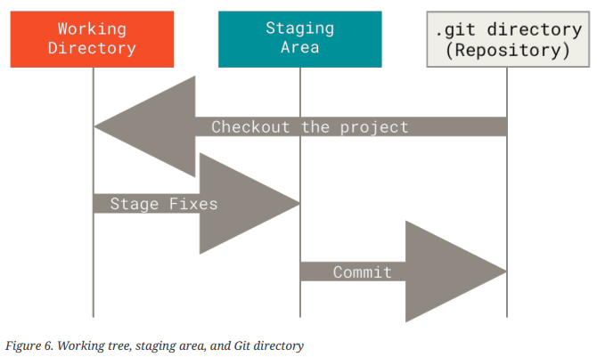
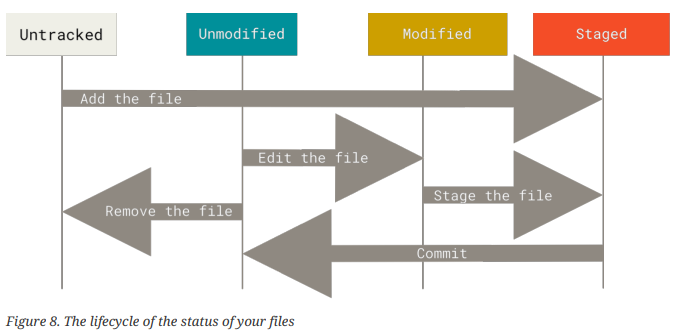
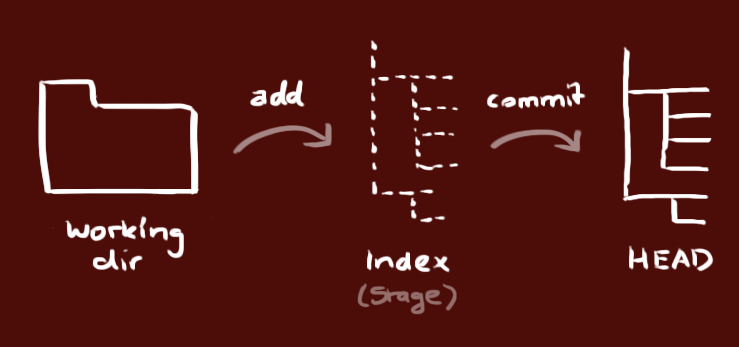
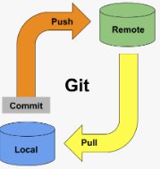

# Bienvenidos al Diplomado Fullstack

## Herramientas a Instalar

 *[Chocolatey](https://chocolatey.org/)
* Visual Studio Code 

```sh
# Para instalar Visual Studio Code usando Chocolatey, ejecuta el siguiente comando:
choco install vscode
```

* GIT 

```sh
# Para instalar Visual Studio Code usando Chocolatey, ejecuta el siguiente comando:
choco install git.install
```

## GIT

### Comandos útiles en git

```sh
# Para instalar Visual Studio Code usando Chocolatey, ejecuta el siguiente comando:
git add . ##Pasa todos los cambios de los archivos del WD al stage
git add <file-name> ## Pasa al stage sólo los cambios del archivo indicado

git commit -m "mensaje para el commit" ## Añade los cambios que esten en el stage al repositorio.

git status ## Nos permite visualizar el estado de git que cambios hay en los árboles mencionados más adelante

git log ## Muestra todos los commits que se llevan hasta ahora

git log --oneline ## Muestra una versión simplificada del registro de los commits

git config --global user.email "un@correo.com"

git config --global user.name "un nombre cualquiera"

```


En git existen 3 arboles.



Para crear un repositorio, hacemos una carpeta y en la terminal de esa carpeta ejecutamos el siguiente comando

```sh
# Para instalar Visual Studio Code usando Chocolatey, ejecuta el siguiente comando:
git init
```

Esto nos creara un repositorio vacío en la carpeta .git dentro de nuestra carpeta, de esta manera podremos comenzar a gestionar nuestros archivos con Git

### Ciclo de vida de los cambios de un archivo



### Pasar archivos entre árboles




### Pregunta ¿Qué pasa si yo tengo un cambio de un archivo en el staging y modifico el mismo archivo?

### Ignoremos archivos

### Veamos los commits

* ejecutamos

```sh

git log
```

miremos la información completa de los commits

* ejecutemos 

```sh

git log --oneline
```
miramos la versión compacta de los commits


### Desarrollo Quiz

https://www.w3schools.com/quiztest/quiztest.asp?qtest=GIT

### CHECKOUT

* vamos a un commit en especifico
```sh

git checkout <hash-of-the-commit>
```

volvemos a la rama master

```sh

git checkout master
```


### Minitaller

* Crear dos archivos más y comencemos a pasar sus cambios entre los repositorios (tip) usar el git status para ver que está pasando, podríamos crear un nuevo repo??


### Branching

#### Creamos una nueva rama


```sh

git checkout -b nueva_rama
```
* ejecutamos el comando 

```sh
git branch
```
* Hacemos cambios y commiteamos como lo sabemos hacer ya.

* ejecutamos 

```sh

git log --oneline
```

* volvemos a master

```sh
git checkout master
```

#### Ingtegrando cambios

Cuando tenemos los cambios de una rama, y queremos fusionarlos en otra, 

* La rama de los cambios sería la rama fuente
* La rama en la cuál queremos poner esos cambios es la rama destino

Para hacer eso.
1. Nos paramos en la rama destino para el ejemplo sería master

```sh
git checkout master
```
2. Hacemos merge de los cambios de la rama fuente:
```sh
git merge nombre_de_nuestra_rama
```

## GITHUB

* Hacemos clone del proyecto deseado de github

```sh
git clone ruta
```

* entramos al repositorio y ejecutamos
```sh
git remote -v
```



* entramos al repositorio y ejecutamos
```sh
git pull origin master
```
* hacemos una nueva rama como ya sabemos

* entramos al repositorio y ejecutamos
```sh
git push origin <nombre nueva rama>
```

